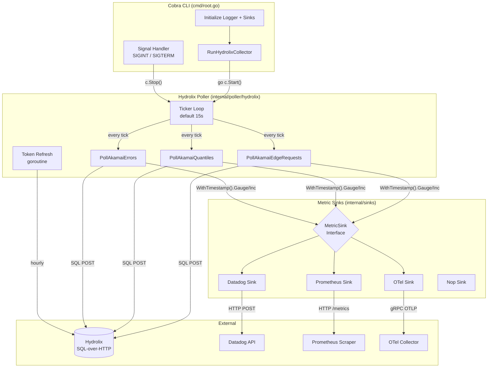
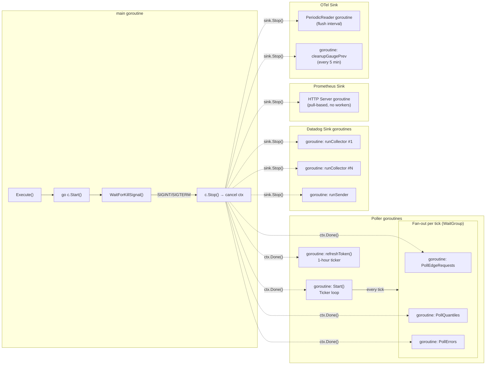
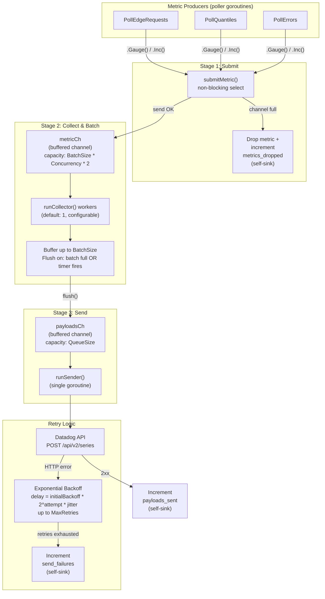
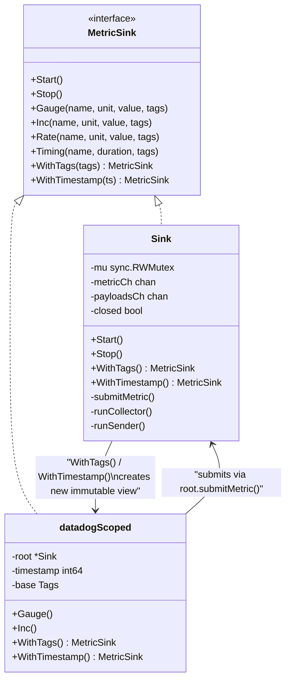
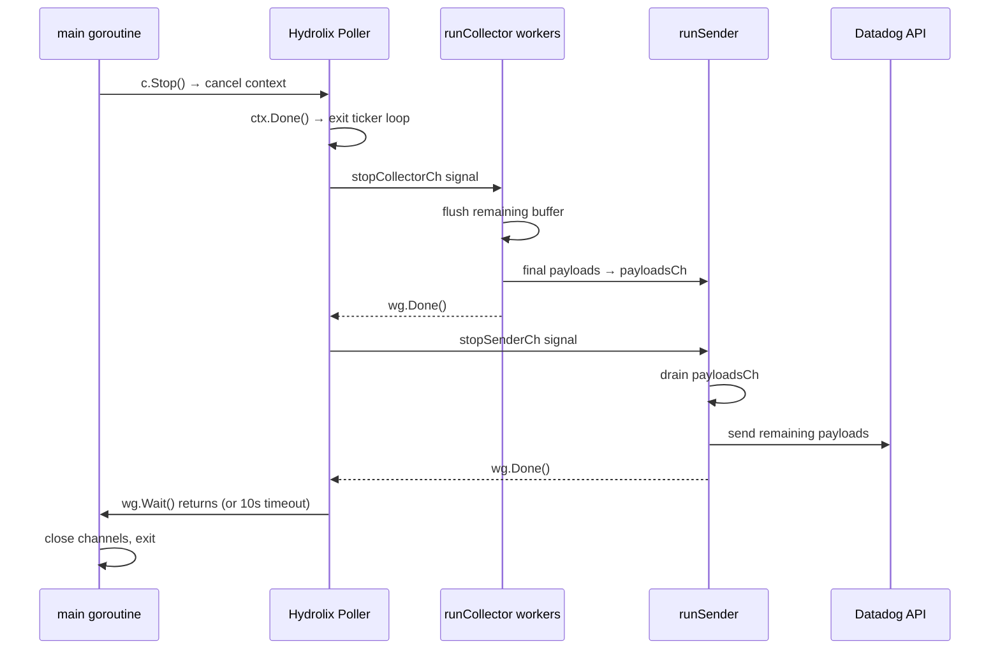

# Architecture

## High-Level Overview

The collector polls Hydrolix for log data, transforms it into pre-aggregated time-series metrics, and fans them out to one or more metric sinks (Datadog, Prometheus, OpenTelemetry).



## Concurrency Model

Every goroutine in the system is tracked by a `sync.WaitGroup` and cancellable via `context.WithCancel`, enabling graceful shutdown with a 10-second timeout.



### Concurrency Summary

| Component | Pattern | Goroutines | Coordination |
|---|---|---|---|
| Poller main loop | Ticker | 1 | `context.WithCancel` |
| Token refresh | Ticker | 1 | `context.WithCancel`, `sync.RWMutex` on token |
| Per-tick queries | Fan-out / fan-in | 3 (per tick) | `sync.WaitGroup` |
| Datadog collectors | Worker pool | N (configurable) | Channels, `sync.WaitGroup` |
| Datadog sender | Single consumer | 1 | Channel |
| Prometheus | HTTP server | 1 | `sync.Mutex` on registry |
| OTel | Periodic reader + cleanup | 2 | `sync.RWMutex` on gauge state |

### Query Window

Each tick fires three parallel SQL queries against a sliding 5-minute window offset from "now" to account for log ingestion lag:

```
  wall clock
──────────────────────────────────────────────►
                 ◄── 6 min ──►◄─ 1 min lag ─►
                 │            │              │
           offsetStart    offsetEnd         now

  Query window: [now - 6min, now - 1min]
```

The 1-minute lag accommodates log delivery SLA (95% within 30s) plus Hydrolix indexing time.

## Datadog Sink Pipeline

The Datadog sink uses a **3-stage buffered pipeline** with backpressure and retry logic. Metrics flow through channels from producers to a batching collector to a serializing sender.



### Backpressure Behavior

The pipeline is **non-blocking by design** -- the poller never stalls waiting for Datadog:

1. **`submitMetric()`** uses a non-blocking `select` on `metricCh`. If the channel is full, the metric is dropped and a `metrics_dropped` counter is incremented on the self-sink (typically Prometheus).
2. **`flush()`** enqueues payloads to `payloadsCh` with a 5-second timeout. If the queue is full for 5s, the payload is lost and logged.
3. **`sendToDatadog()`** retries with exponential backoff (`2^attempt * jitter`). After `MaxRetries` failures, the payload is discarded and `send_failures` is incremented.

Because the poller refills the 5-minute query window every tick, a brief drop is self-healing -- the next poll re-aggregates the same time range.

### Scoped Views for Thread Safety

The Datadog sink uses an **immutable scoped view** pattern to avoid data races:



When multiple goroutines call `WithTimestamp()` or `WithTags()`, each gets its own immutable `datadogScoped` struct. All scoped views funnel metrics back to the root `Sink` through `submitMetric()`, which is the single serialization point into `metricCh`.

### Self-Monitoring

The Datadog sink reports its own health metrics to a **separate sink** (typically Prometheus) to avoid feedback loops:

| Self-Metric | Type | Meaning |
|---|---|---|
| `hydrolix.sink.metrics_dropped` | Counter | Metrics dropped due to full `metricCh` |
| `hydrolix.sink.send_retries` | Counter | Retry attempts to Datadog API |
| `hydrolix.sink.payloads_sent` | Counter | Successfully sent payloads |
| `hydrolix.sink.send_failures` | Counter | Payloads dropped after all retries exhausted |

### Shutdown Sequence



The shutdown is **ordered**: collectors flush and exit first, ensuring all buffered metrics reach the sender's queue before the sender drains and exits.
